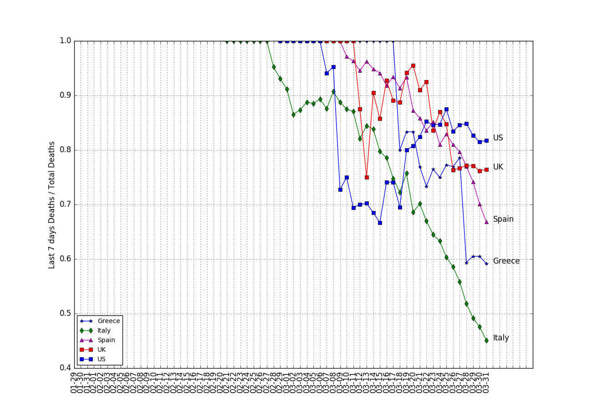

# COVID-19 plots based on daily reports by Johns Hopkins CSSE

## Run the script

**Requirements**

* Download the data repository: https://github.com/CSSEGISandData/COVID-19
* Python version min 3.5, numpy, matplotlib
* Not all countries all plotted. More countries can be added in the ```./countries.py``` file by adding them to the array of ```allCountries``` and providing their ```population```.

Minimum command line options:
```
python read.py <path of csse_covid_19_daily_reports>/*.csv
```
Will parse all files but will not do anything else.

See Help below for options.

## Examples

All examples below assume that the data repository COVID-19 is located in the parent directory.

Plot all countries cases and deaths
```
python read.py ../COVID-19/csse_covid_19_data/csse_covid_19_daily_reports/*.csv -p
```


Plot last week's death per total deaths for specific countries
```
python read.py ../COVID-19/csse_covid_19_data/csse_covid_19_daily_reports/*.csv -w -c Greece Italy Spain UK US
```


Animate deaths per week vs total deaths for all countries, for the last 30 days
```
python read.py ../COVID-19/csse_covid_19_data/csse_covid_19_daily_reports/*.csv -a -d 30 -c Greece Italy Spain UK US
```
Save a gif animation
```
python read.py ../COVID-19/csse_covid_19_data/csse_covid_19_daily_reports/*.csv -a -s anim.gif
```


## Help
```
python read.py -h
```

Output:
```
usage: read.py [-h] [-c [COUNTRY [COUNTRY ...]]] [-d [DAYS]]
               [--maxY MAXY MAXY MAXY MAXY] [-l] [-i] [--csv] [-p] [-a]
               [-n [NUMBER]] [-s [SAVETOFILE]] [-m]
               [--skip SKIP SKIP SKIP SKIP]
               files [files ...]

Plot graphs for the COVID-19

positional arguments:
  files                 csv files to read from

optional arguments:
  -h, --help            show this help message and exit
  -c [COUNTRY [COUNTRY ...]], --country [COUNTRY [COUNTRY ...]]
                        countries to present in plots
  -d [DAYS], --days [DAYS]
                        number of days to plot before today. By default plots
                        start from the beginning of data collection.
  --maxY MAXY MAXY MAXY MAXY
                        y axes limits for time plots
  -l, --logY            use log scale for the Y axes of time plots
  -i, --interactive     open interactive python console after parsing the
                        files
  --csv                 generate CSV output
  -p, --plot            time plots of cases/deaths/recoveries/active. Choose
                        plots to skip with the --skip flag
  -a, --animate         animate new numbers/total numbers. Choose which
                        numbers to plot with the --number flag
  -n [NUMBER], --number [NUMBER]
                        number to animate 0:cases, 1:deaths, 2:recovered,
                        3:active
  -s [SAVETOFILE], --savetofile [SAVETOFILE]
                        file to save the animation
  -m, --million         in plots divide values by country population in
                        millions
  --skip SKIP SKIP SKIP SKIP
                        boolean (True|False) whether the specific time plot
                        will be drawn. Plots: Cases, Deaths, Recovered, Active
  -w, --week            Plot last week vs total

```

## Interactive mode

In interactive mode:

Plot graphs
```
p.plotGraph()
```
or starting some days ago (e.g. 20)
```
p.plotGraph(20)
```

Animate deaths/week vs total deaths. 0:cases, 1:deaths, 2:recovered, 3:active
```
p.animate(1)
```
or starting some days ago (e.g. 20)
```
p.animate(1, 20)
```

